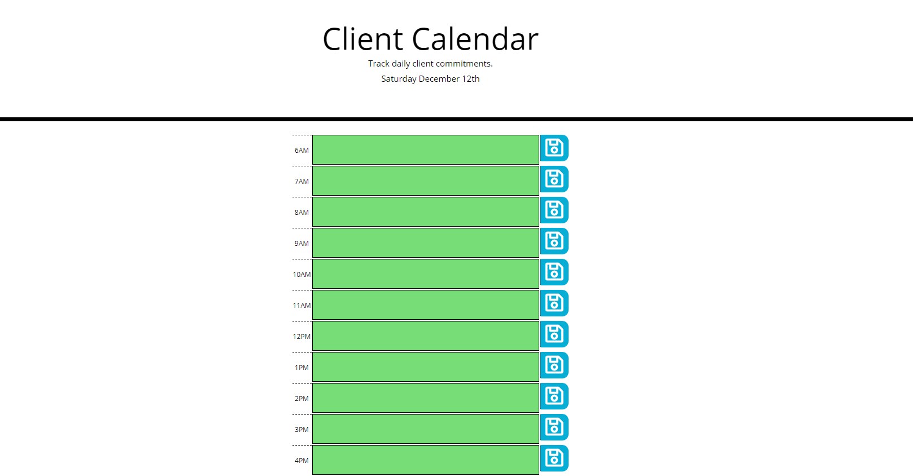

# Daily Planner

This calendar features HTML and CSS powered by jQuery and uses the Moment.js library to work with date and time.  Users can save events for each hour of the day; to do this, click on colored textarea corresponding to desired time.  Type whichever event or task you would like to schedule, then click the save button to the right of text box.  

## Deployed

Repo Link: https://descoding.github.io/ClientCalendar/

Site Link: https://descoding.github.io/ClientCalendar/index.html

## Demo

